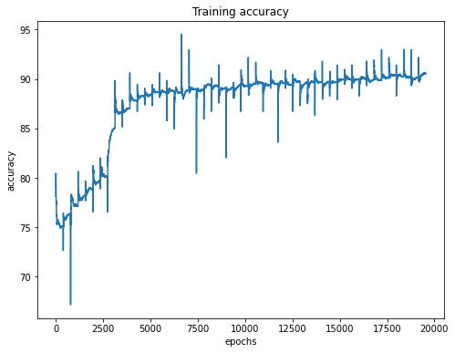
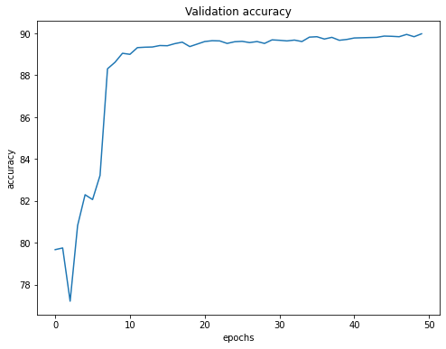
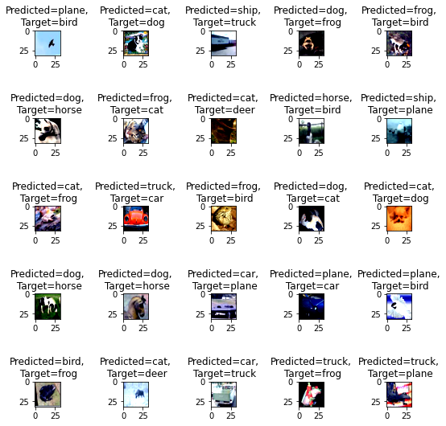
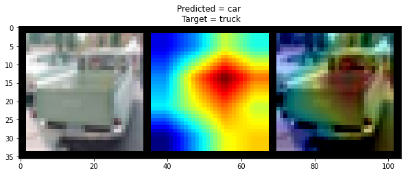

# Session 10: Advanced Concepts in Training & Learning Rates

The session covers concept of learning rate in detail. There are two types of learning rate algorithm.

* Constant learning rate
* Adaptive learning rate

The learning rate is a hyperparameter that controls how much to change the model in response to the estimated error each time the model weights are updated. Choosing the learning rate is challenging as a value too small may result in a long training process that could get stuck, whereas a value too large may result in learning a sub-optimal set of weights too fast or an unstable training process.

## Assignment 10:

* Implement LR Finder using ( https://github.com/davidtvs/pytorch-lr-finder)
* Implement ReduceLROnPlatea (https://pytorch.org/docs/stable/optim.html#torch.optim.lr_scheduler.ReduceLROnPlateau)
* Target accuracy: 88%
* Number of epochs: 50

## Solution

## Understanding code

The following are the files used in the main notebook:

* train_test_data_loader.py : It gives data loader for
train test data for the given transforms.
  
* train_test_transform.py : It uses Albumentation library and return the list of train test transforms

* trainer.py : It trains the model.

* resnet.py : It returns ResNet model.

* input_data_explore.py : It takes train data loader
and return grid of some input samples.
  
* misclassified_images.py : It inferences the model on the test data and returns grid of misclassified images.

* gradcam.py : It implements gradcam functionality. (Reference : https://github.com/vickyliin/gradcam_plus_plus-pytorch)

* lr_finder.py : It finds optimal learning rate. (source :https://github.com/davidtvs/pytorch-lr-finder)

### Transformations used in code

* ToTensor
* Normalize
* Cutout
* Horizontal Flip
* Rotation

### Training accuracy graph

### Testing accuracy graph

### Misclassified images

### Grad Cam results

