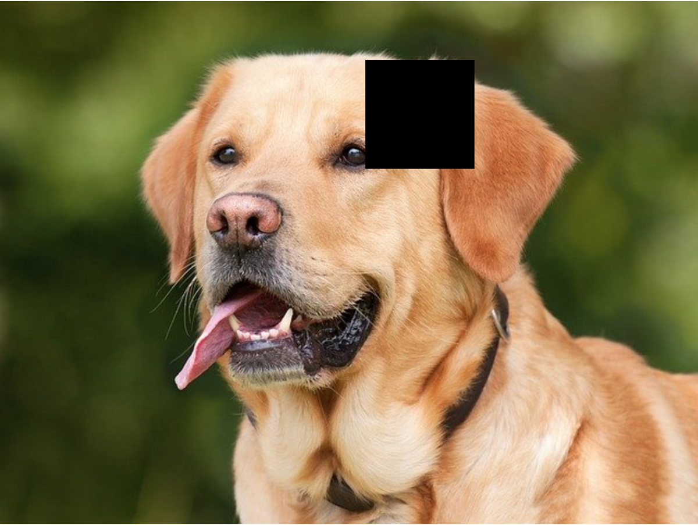
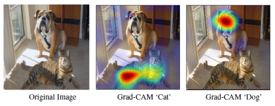
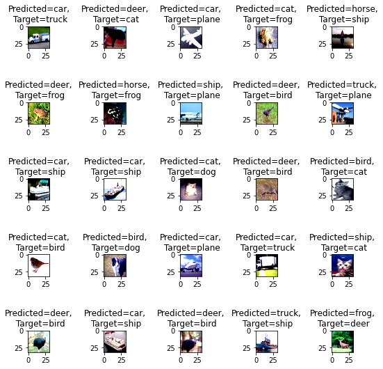
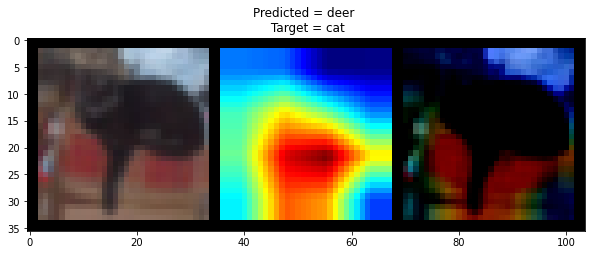
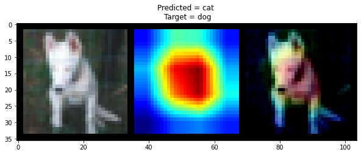

# Assignment 9: Image augmentation

In this assignment we are going to implement two main things

* Image augmentation using Albumentation library (https://github.com/albumentations-team/albumentations)
* Understanding how network is looking at data with the help of **GradCam library**.

## Why to use Albumentation library?

* Albumentations supports all common computer vision tasks such as classification, semantic segmentation, instance segmentation, object detection, and pose estimation.
* The library provides a simple unified API to work with all data types: images (RBG-images, grayscale images, multispectral images), segmentation masks, bounding boxes, and keypoints.
* Albumentations is fast. We benchmark each new release to ensure that augmentations provide maximum speed.

## Cutout transformation

Cutout is an image augmentation and regularization technique that randomly masks out square regions of input during training. and can be used to improve the robustness and overall performance of convolutional neural networks. 

## Understanding GradCam

Grad-CAM is a popular technique for visualizing where a convolutional neural network model is looking. Grad-CAM is class-specific, meaning it can produce a separate visualization for every class present in the image:

## Understanding code

The following are the files used in the main notebook:

* train_test_data_loader.py : It gives data loader for
train test data for the given transforms.
  
* train_test_transform.py : It uses Albumentation library and return the list of train test transforms

* trainer.py : It trains the model.

* resnet.py : It returns ResNet model.

* input_data_explore.py : It takes train data loader
and return grid of some input samples.
  
* misclassified_images.py : It inferences the model on the test data and returns grid of misclassified images.

* gradcam.py : It implements gradcam functionality. (Reference : https://github.com/vickyliin/gradcam_plus_plus-pytorch)

### Transformations used in code

* ToTensor
* Normalize
* Cutout
* Horizontal Flip
* Rotation

### Misclassified images

### Grad Cam results

